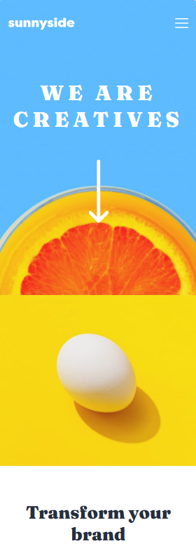

# Frontend Mentor - Sunnyside agency landing page solution

This is a solution to the [Sunnyside agency landing page challenge on Frontend Mentor](https://www.frontendmentor.io/challenges/sunnyside-agency-landing-page-7yVs3B6ef). Frontend Mentor challenges help you improve your coding skills by building realistic projects.

## Table of contents

- [Overview](#overview)
  - [The challenge](#the-challenge)
  - [Screenshot](#screenshot)
  - [Links](#links)
- [My process](#my-process)
  - [Built with](#built-with)
  - [What I learned](#what-i-learned)
  - [Continued development](#continued-development)
- [Author](#author)

## Overview

### The challenge

Users should be able to:

- View the optimal layout for the site depending on their device's screen size
- See hover states for all interactive elements on the page

### Screenshot

### Links

- Solution URL: [https://www.frontendmentor.io/solutions/agency-landing-page-95HaxGRPKp](https://www.frontendmentor.io/solutions/agency-landing-page-95HaxGRPKp)
- Live Site URL: [https://mateusrissodiblasio.github.io/sunnyside-agency-landing-page](https://mateusrissodiblasio.github.io/sunnyside-agency-landing-page)

## My process

### Built with

- Semantic HTML5 markup
- CSS custom properties
- Flexbox
- CSS Grid
- Mobile-first workflow

### What I learned

CSS Grid-template usage, on this challenge, within desktop screen sizes I learned how to use CSS Grid-template to display content which is good for accurate positioning flex boxes. Toggle between desktop and mobile header menu.

### Continued development

CSS Grid is a powerful tool, learning some basics showed me that it has many usage cases. Need to go further on this topic.

## Author

- Website - [Mateus Risso Di Blasio](https://github.com/MateusRissoDiBlasio)
- Frontend Mentor - [@MateusRissoDiBlasio](https://www.frontendmentor.io/profile/MateusRissoDiBlasio)